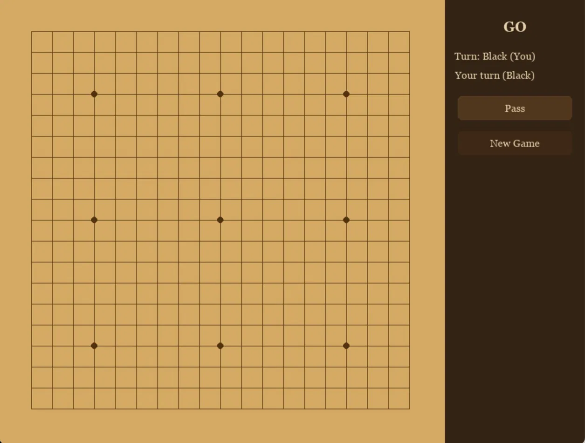

# go_engine

A 19×19 Go engine written in C++ with a neural network-guided MCTS player and a pygame GUI. Play against the bot or watch it think.


---

## How it works

- **Engine**: Custom bitboard-based Go rules engine in C++ with union-find for group tracking
- **Search**: Monte Carlo Tree Search (MCTS) with PUCT selection
- **Network**: 8-block residual neural network (policy + value heads) trained on KGS human games
- **Protocol**: GTP (Go Text Protocol) — standard interface between GUI and engine
- **GUI**: pygame board with click-to-play, pass button, and new game

---

## Requirements

### C++ engine
- clang++ with C++17 support
- [libtorch](https://pytorch.org/get-started/locally/) (comes with your PyTorch installation)

### Python GUI
```bash
pip install pygame
```

### Python training (optional)
```bash
pip install torch numpy
```

---

## Setup

### 1. Clone the repo
```bash
git clone https://github.com/yourusername/go_engine.git
cd go_engine
```

### 2. Compile the engine
```bash
TORCH=$(python -c "import torch; import os; print(os.path.dirname(torch.__file__))")

clang++ -std=c++17 -O2 \
  -I $TORCH/include \
  -I $TORCH/include/torch/csrc/api/include \
  -L $TORCH/lib \
  -Wl,-rpath,$TORCH/lib \
  -ltorch -ltorch_cpu -lc10 \
  gtp.cpp boardstate.cpp mcts.cpp -o gobot
```

### 3. Make sure `gonet.pt` is in the project root
The trained model file must be present. Either download it or train your own (see below).

### 4. Run the GUI
```bash
python gui/gamegui.py
```

---

## Playing

- **Click** a point on the board to place a black stone
- The bot (white) responds automatically
- Click **Pass** to pass your turn
- Click **New Game** to reset

---

## Project structure

```
go_engine/
├── gtp.cpp            # GTP interface — main entry point for the engine
├── boardstate.cpp/hpp # Go rules, move generation, captures, scoring
├── bitboard.hpp       # 384-bit bitboard for 19×19 board representation
├── mcts.cpp/hpp       # MCTS with PUCT selection and neural network evaluation
├── zobrist.hpp        # Zobrist hashing for superko detection
├── tests.cpp          # Unit tests for captures, ko, suicide, legal moves
├── gui/
│   └── gamegui.py     # pygame GUI with GTP engine subprocess
├── network.py         # PyTorch residual network definition
├── train.py           # Training script
├── prepare_data.py    # SGF → training data converter
└── gonet.pt           # Trained model (TorchScript)
```

---

## Training your own model

### 1. Get SGF game files
Download KGS game archives from [https://www.gokgs.com/archives.jsp](https://www.gokgs.com/archives.jsp) and extract to a folder.

### 2. Prepare training data
```bash
python prepare_data.py --data_dir ./kgs_data --out_dir ./data
```

### 3. Train
```bash
python train.py
```

Training runs for 30 epochs by default and saves checkpoints after each epoch. Resume anytime by running `train.py` again — it picks up from the last checkpoint.

### 4. The trained model is saved as `gonet.pt` automatically.

---

## Architecture

**Network**: 8 residual blocks, 128 channels, policy + value heads  
**Input**: 3 × 19 × 19 tensor — current player stones, opponent stones, turn indicator  
**Policy output**: 362 move probabilities (361 board points + pass)  
**Value output**: single scalar in [-1, 1] — current player's win probability

**MCTS**: PUCT formula with network policy as prior, network value replacing random rollouts
